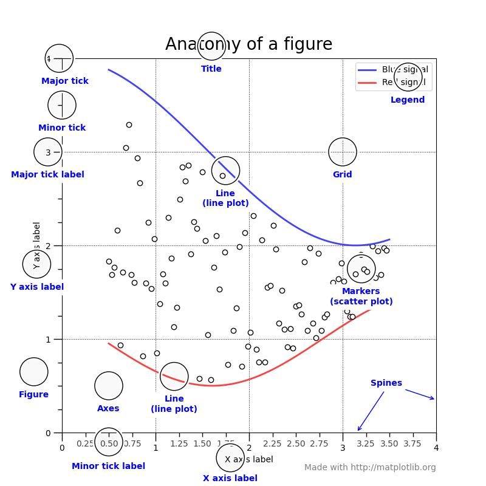
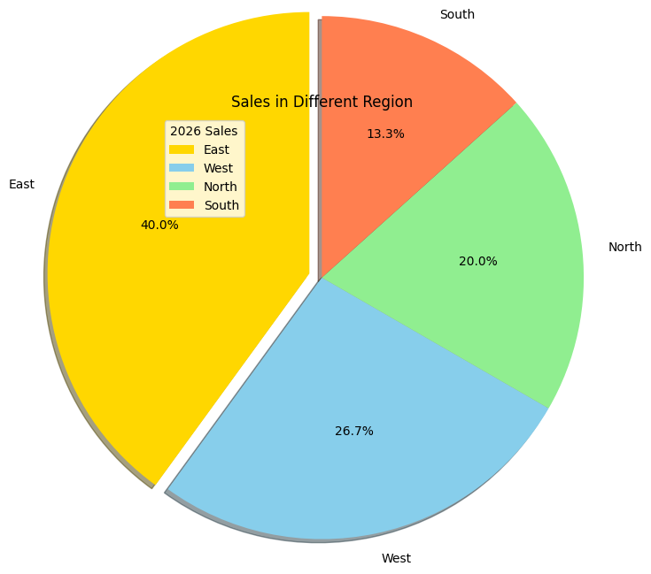
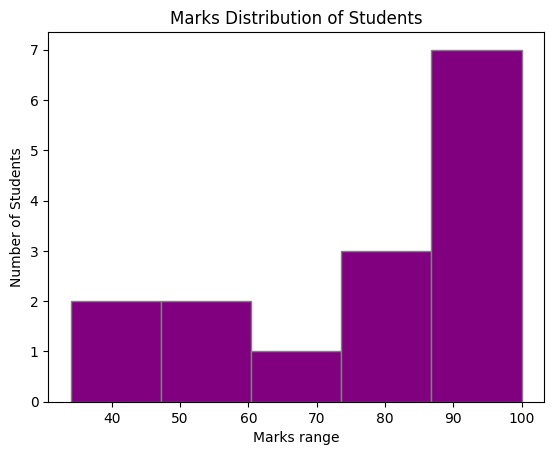
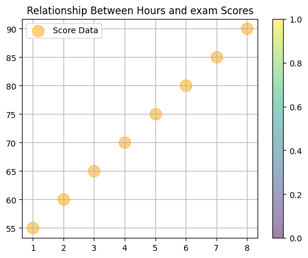
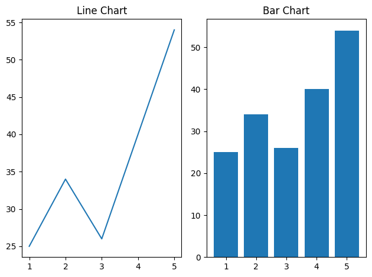
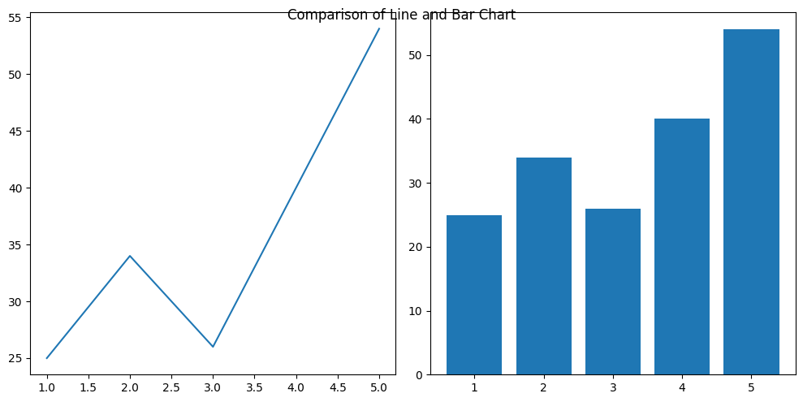

# Matplotlib

### What is Matplotlib?

- Matplotlib is a low level graph plotting library in python that serves as a visualization utility.
- Matplotlib was created by John D. Hunter.
- Matplotlib is open source and we can use it freely.
- Matplotlib is mostly written in python, a few segments are written in C, Objective-C and Javascript for Platform compatibility.

## Matplotlib Pyplot

### Pyplot

- Most of the Matplotlib utilities lies under the pyplot submodule, and are usually imported under the plt alias:  
  `import matplotlib.pyplot as plt`

### Anatomy of Mtplotlib Plot

- A Matplotlib plot is made up of several components. Understanding these parts helps you customize and create professional visualizations.

#### Image:



```
Figure
│
├── Axes
│   ├── Title
│   ├── X-Axis
│   │   ├── Ticks
│   │   └── Tick Labels
│   ├── Y-Axis
│   │   ├── Ticks
│   │   └── Tick Labels
│   ├── Grid
│   ├── Legend
│   ├── Spines
│   └── Plot Data (Line, Bar, Scatter, etc.)
```

#### 1. Figure:

- The Figure is the entire window or canvas that contains all plot elements.

#### 2. Axes

- The Axes is the actual plotting area where data is displayed.

#### 3. Axis

- An Axis represents the scale of the plot.
- There are typically:
  - X-Axis (horizontal)
  - Y-Axis (vertical)

#### 4. Title

- Describes the plot. (Heading of plot/graph)

#### 5. Labels (X-Label and Y-Label)

- Used to describe the meaning of each axis.

#### 6. Ticks

- Ticks are the marks along the axes.

#### 7. Tick Labels

- Values displayed beside the ticks.

#### 8. Grid

- Reference lines that improve readability.
- Horizontal and vertical guide lines appear.

#### 9. Plot Area

- Region where data points, lines, bars, etc. are drawn.

#### 10. Legend

- Explains different plotted datasets.

#### 11. Spines

- The borders around the plot area.
- Spines:
  - Top
  - Bottom
  - Left
  - Right

#### 12. Text and Annotations

- Used to add notes on the graph.

#

## Types of Data in Matplotlib and Seaborn

- Before creating visualizations in Matplotlib or Seaborn, it is important to understand the type of data you are working with.
- The choice of plot depends on whether your data is Numerical or Categorical.

```
Data
│
├── Numerical Data
│
└── Categorical Data
    │
    ├── Ordinal Data
    │
    └── Nominal (Non-Ordinal) Data
```

### 1. Numerical Data:

- Numerical data consists of values that can be measured, counted, or used in mathematical calculations.

#### Characteristics

- Represented by numbers.
- Arithmetic operations can be performed.
- Can be sorted naturally from smallest to largest.

### 2. Categorical Data

- Categorical data represents groups, labels, or categories rather than numeric measurements.
- Examples:
  - Gender
  - Department
  - City
  - Product Category

Categorical data is divided into two types:

```
Categorical Data
│
├── Ordinal
│
└── Nominal
```

#### A. Ordinal Data

- Ordinal data consists of categories that have a meaningful order or ranking.
- Characteristics
  - Categories can be arranged in order.
  - The difference between categories is not necessarily measurable.

- Examples
  - Education Level: `High School < Bachelor's < Master's < PhD`
  - Customer Satisfaction: `Poor < Average < Good < Excellent`
  - T-Shirt Size: `Small < Medium < Large < XL`
  - Rating System: `1 Star < 2 Star < 3 Star < 4 Star < 5 Star`

#### B. Nominal (Non-Ordinal) Data

- Nominal data consists of categories that do not have any natural order or ranking.
- Characteristics
  - Categories are simply labels.
  - One category is not greater or smaller than another.
  - Only classification is possible.

- Examples
  - Gender: `Male, Female`
  - Blood Group: `A, B, AB, O`
  - Department: `IT, HR, Finance, Marketing`
  - City: `Pune, Mumbai, Delhi, Bangalore`

### Comparison: Ordinal vs Nominal:

| Feature                            | Ordinal               | Nominal         |
| ---------------------------------- | --------------------- | --------------- |
| Categories                         | Yes                   | Yes             |
| Natural Order                      | Yes                   | No              |
| Ranking Possible                   | Yes                   | No              |
| Mathematical Difference Meaningful | No                    | No              |
| Example                            | Poor, Good, Excellent | IT, HR, Finance |

### Which Plots to Use?

| Data Type                 | Matplotlib                | Seaborn                               |
| ------------------------- | ------------------------- | ------------------------------------- |
| Numerical                 | plot(), scatter(), hist() | lineplot(), scatterplot(), histplot() |
| Ordinal                   | bar()                     | countplot(), barplot()                |
| Nominal                   | bar(), pie()              | countplot(), barplot()                |
| Numerical + Numerical     | scatter()                 | scatterplot()                         |
| Numerical + Categorical   | boxplot()                 | boxplot(), violinplot()               |
| Categorical + Categorical | bar()                     | countplot()                           |

### Quick Summary

```
Data
│
├── Numerical Data
│   ├── Discrete
│   └── Continuous
│
└── Categorical Data
    │
    ├── Ordinal
    │   ├── Low
    │   ├── Medium
    │   └── High
    │
    └── Nominal
        ├── IT
        ├── HR
        └── Finance
```

### Rule of Thumb:

- If the values are numbers and calculations make sense → **Numerical Data.**
- If the values are labels/categories → **Categorical Data.**
- If categories have a ranking → **Ordinal Data**.
- If categories are just names without ranking → **Nominal Data.**

#

## Univariate, Bivariate, and Multivariate Analysis

- In data analysis and visualization (Matplotlib/Seaborn), data can be analyzed based on the number of variables involved.

```
Data Analysis
│
├── Univariate Analysis
│   └── 1 Variable
│
├── Bivariate Analysis
│   └── 2 Variables
│
└── Multivariate Analysis
    └── More than 2 Variables
```

### 1. Univariate Analysis

- Univariate means analyzing one variable at a time.
- Purpose:
  - Understand the distribution of a single variable.
  - Find minimum, maximum, average, spread, and outliers.

#### Example Dataset:

| Age |
| --- |
| 21  |
| 25  |
| 22  |
| 28  |
| 30  |

- Only Age is being analyzed.

#### Questions Answered

- What is the average age?
- What is the highest age?
- How are ages distributed?

### 2. Bivariate Analysis

- Bivariate means analyzing two variables together.
- Purpose:
  - Identify relationships between two variables.
  - Compare one variable against another.
  - Find correlations and trends.

#### Example Dataset

| Height | Weight |
| ------ | ------ |
| 150    | 50     |
| 160    | 60     |
| 170    | 70     |
| 180    | 80     |

#### Variables:

- Height
- Weight

#### Questions Answered

- Does weight increase with height?
- Is there a positive or negative relationship?
- How strong is the correlation?

#### Types of Bivariate Analysis

- Numerical vs Numerical
- Categorical vs Numerical
- Categorical vs Categorical

### 3. Multivariate Analysis

- Multivariate means analyzing more than two variables simultaneously.
- Purpose:
  - Discover complex relationships.
  - Compare multiple factors together.
  - Perform advanced data analysis.

#### Example Dataset

| Age | Salary | Experience |
| --- | ------ | ---------- |
| 25  | 30000  | 2          |
| 30  | 50000  | 5          |
| 35  | 70000  | 8          |

#### Variables:

- Age
- Salary
- Experience

#### Questions Answered

- Does experience affect salary?
- How do age and experience together influence salary?
- Which factors are related?

#### Comparison Table

| Feature             | Univariate              | Bivariate                                | Multivariate                  |
| ------------------- | ----------------------- | ---------------------------------------- | ----------------------------- |
| Number of Variables | 1                       | 2                                        | More than 2                   |
| Purpose             | Understand one variable | Study relationship between two variables | Analyze complex relationships |
| Example             | Age                     | Height vs Weight                         | Age vs Salary vs Experience   |
| Seaborn Plots       | histplot(), boxplot()   | scatterplot(), barplot()                 | pairplot(), heatmap()         |
| Matplotlib Plots    | hist(), boxplot()       | scatter(), plot()                        | heatmap, 3D scatter           |

#### Visual Summary

```
UNIVARIATE
-----------
Age

BIVARIATE
----------
Height ──► Weight

MULTIVARIATE
-------------
Age
 │
 ├── Salary
 │
 └── Experience
```

#### Easy Way to Remember

- **Univariate** = 1 Variable → Analyze a single column.
- **Bivariate** = 2 Variables → Analyze the relationship between two columns.
- **Multivariate** = 3 or More Variables → Analyze multiple columns together.

For example, in an employee dataset:

- Age → Univariate
- Age vs Salary → Bivariate
- Age, Salary, Experience → Multivariate


## Bar Plot in Matplotlib
- A bar plot uses rectangular bars to represent data categories, with bar length or height proportional to their values.
- It compares discrete categories, with one axis for categories and the other for values.
- A Bar Plot (Bar Chart) is used to compare values across different categories using rectangular bars.
- The height (or length) of each bar represents the value of a category.
- The x-axis typically shows the categories being compared, while the y-axis shows the values associated with those categories.

- This visual format makes it easy to compare quantities across different groups.
- This function takes several parameters:
    - **x:** The categories (e.g., fruits).
    - **height:** The corresponding values (e.g., sales).
    - **width:** The width of the bars (default is 0.8).
    - **bottom:** The baseline for the bars (default is 0).
    - **align:** How to align bars ('center' or 'edge')

### Sytnax:
```
plt.bar(x-axis_value, height of bar (generally it is y-axis value), color = "color_name", label = "label_name")`
```

| Parameter | Description                       |
| --------- | --------------------------------- |
| x         | Categories or positions on X-axis |
| height    | Values (height of bars)           |
| width     | Width of bars                     |
| color     | Color of bars                     |
| label     | Legend label                      |


### Pie Plot in Matplotlib
- A Pie Chart is a circular chart divided into slices, where each slice represents a proportion or percentage of the whole.
- It is mainly used to show composition or part-to-whole relationships.
- Pie chart shows how each category contributes to the total.

### When to Use a Pie Chart?
- ✅ Showing percentage contribution
- ✅ Market share analysis
- ✅ Budget allocation
- ✅ Population distribution

### Syntax:
``` 
plt.pie(values, label = "label_list", color = "color_name", autopct = "%1.1f%%")
```

| Parameter  | Description             |
| ---------- | ----------------------- |
| x          | Values for slices       |
| labels     | Labels for slices       |
| colors     | Slice colors            |
| autopct    | Display percentages     |
| explode    | Separate slice from pie |
| shadow     | Add shadow effect       |
| startangle | Rotate chart            |
| radius     | Pie radius              |




## Histogram Plot in Matplotlib
- A Histogram is used to visualize the distribution of numerical data.
- It groups data into intervals called bins and shows how many values fall into each interval.
- Unlike a Bar Plot, a Histogram is used for continuous numerical data, and the bars touch each other.

### Why Use a Histogram?
- ✅ Understand data distribution
- ✅ Find the most common value range
- ✅ Detect skewness (outlier)
- ✅ Identify outliers
- ✅ Analyze frequency of numerical data

### Syntax:
```
plt.hist(data, bins = "number_of_bins", color = "color_name", edgecolor = "color_name")
```

| Parameter | Description           |
| --------- | --------------------- |
| x         | Numerical data        |
| bins      | Number of intervals   |
| color     | Bar color             |
| edgecolor | Border color          |
| density   | Normalize frequencies |
| label     | Legend label          |



## Scatter Plot in Matplotlib
- A Scatter Plot is used to visualize the relationship between two numerical variables.
- Each point on the graph represents one observation with coordinates (x, y).
- It is one of the most commonly used plots for Bivariate Analysis.

### Why Use a Scatter Plot?
- ✅ Identify relationships between variables
- ✅ Find trends and patterns
- ✅ Detect outliers
- ✅ Analyze correlation
- ✅ Compare two numerical variables

### Syntax:
```
plt.scatter(x-axis_value, y-axis_value, color = "color_name", marker = "marker symbol", label = "label_name")
```

| Parameter | Description   |
| --------- | ------------- |
| x         | X-axis values |
| y         | Y-axis values |
| s(size)   | Marker size   |
| c/color   | Marker color  |
| marker    | Marker style  |
| alpha     | Transparency  |
| label     | Legend label  |
| cmap      | color mapping |

#### Marker Style:
| Marker | Shape         |
| ------ | ------------- |
| `o`    | Circle        |
| `*`    | Star          |
| `s`    | Square        |
| `^`    | Triangle Up   |
| `v`    | Triangle Down |
| `+`    | Plus          |
| `x`    | Cross         |



## Subplots in Matplotlib
- A subplot allows you to place multiple plots (Axes) inside a single Figure.
- This is useful when you want to compare different charts or datasets side by side.

### Why Use Subplots?
- Compare multiple datasets in one figure.
- Create dashboards and reports.
- Save space by combining plots.
- Show different visualizations together.

### Figure Vs Subplot
```
Figure (Entire Canvas)
│
├── Subplot 1 (Axes)
├── Subplot 2 (Axes)
├── Subplot 3 (Axes)
└── Subplot 4 (Axes)
```

### Example:
```
+----------------------------------+
|            Figure                |
|                                  |
| +----------+  +----------+       |
| | Plot 1   |  | Plot 2   |       |
| +----------+  +----------+       |
|                                  |
| +----------+  +----------+       |
| | Plot 3   |  | Plot 4   |       |
| +----------+  +----------+       |
+----------------------------------+
```

### Method 1: Using plt.subplot()
### Syntax:
```
plt.subplot(nrows, ncols, index)
```

| Parameter | Description                             |
| --------- | --------------------------------------- |
| nrows     | Number of rows                          |
| ncols     | Number of columns                       |
| index     | Position of the subplot (starts from 1) |



### Method 2: Using plt.subplots() (Recommended)
- This is the modern and most commonly used approach.

### Syntax
#### Single Plot
```
fig, ax = plt.subplots()
```

#### Multiple Plots
```
fig, axs = plt.subplots(rows, cols)
```



## savefig() in Matplotlib
- The savefig() function is used to save a Matplotlib figure as an image or document file instead of only displaying it on the screen.

### Why Use savefig()?
- ✅ Save charts for reports
- ✅ Export graphs as images
- ✅ Share visualizations
- ✅ Create dashboards and presentations

### Syntax:
```
plt.savefig(fname)
or
fig.savefig(fname)
```

| Parameter   | Description                       |
| ----------- | --------------------------------- |
| fname       | File name or path                 |
| dpi         | Resolution of image               |
| format      | File format (png, jpg, pdf, etc.) |
| bbox_inches | Remove extra white space          |
| transparent | Transparent background            |
| facecolor   | Figure background color           |


### Save in Different Formats:
- .pgn(default)
- .jpg
- .pdf
- .svg

### Set Image Resolution (dpi)
```
DPI = Dots Per Inch
```

- Higher DPI gives better quality.

| DPI | Quality                |
| --- | ---------------------- |
| 72  | Screen display         |
| 100 | Basic                  |
| 200 | Good                   |
| 300 | High quality (reports) |
| 600 | Print quality          |


